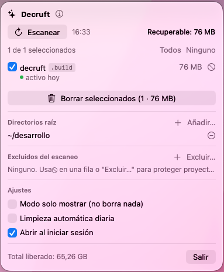

# Decruft 🧹

**[English](#english) · [Español](#español)**

Decruft is a macOS menu bar app that frees disk space by deleting the *cruft* your dev projects accumulate — folders any tool can regenerate — `node_modules`, `.next`, Python venvs, build outputs…

Decruft es una app de barra de menús para macOS que libera disco borrando las carpetas regenerables de tus proyectos — `node_modules`, `.next`, venvs de Python, builds…



---

## English

### What it does

- **Scans** your configured root folders (default `~/desarrollo`) for regenerable folders: `node_modules`, `.next`, `.nuxt`, `.output`, `.svelte-kit`, `.turbo`, `.parcel-cache`, `.vite`, `.cache`, `coverage`, `.build`, Python virtualenvs (`.venv`/`venv`/`env` containing `pyvenv.cfg`), and `dist`/`build`/`out` when they are actual build output of a JS or Android project (parent has `package.json` or Gradle files).
- Shows each folder with its **project, type, size, and days of inactivity** (latest file modification in the project, excluding regenerable folders and `.git`).
- **Manual cleanup** with per-folder selection, or **daily automatic cleanup** that only touches projects inactive for ≥ N days (15 by default, configurable), with a macOS notification of what was freed.
- **Exclusions** to protect projects you are actively working on, and a **dry-run mode** (on by default) that shows what would be deleted without touching anything.
- Deletion is direct (like `rm -rf`), no Trash: everything it deletes regenerates with `npm install` or your next build.
- UI in **English and Spanish** — it follows your system language (per-app override available in System Settings → Language & Region).
- **Safety rule**: inside vendored trees (`vendor`, `wp-includes`, `wp-admin`, `wp-content`, `site-packages`) all detection is disabled except `node_modules` — a `dist` or `build` in there is installed plugin/package code, not your build output, and deleting it would break the site.

### Install

**Option A — Download**: grab the `.dmg` (drag to Applications) or the `.zip` from the [latest release](https://github.com/vicengd/decruft/releases/latest). The app is ad-hoc signed (not notarized), so on first launch use right-click → Open, or run:

```sh
xattr -dr com.apple.quarantine /Applications/Decruft.app
```

**Option B — Build from source** (requires Xcode with Swift 6, macOS 14+):

```sh
git clone https://github.com/vicengd/decruft.git
cd decruft
make install   # builds and copies Decruft.app to /Applications, then opens it
```

`make build` builds without installing; `make run` builds and opens from `build/`.

Config lives in `~/Library/Application Support/Decruft/config.json`.

---

## Español

### Qué hace

- **Escanea** los directorios raíz configurados (por defecto `~/desarrollo`) buscando carpetas regenerables: `node_modules`, `.next`, `.nuxt`, `.output`, `.svelte-kit`, `.turbo`, `.parcel-cache`, `.vite`, `.cache`, `coverage`, `.build`, virtualenvs de Python (`.venv`/`venv`/`env` con `pyvenv.cfg`) y `dist`/`build`/`out` cuando son output de build de un proyecto JS o Android (padre con `package.json` o Gradle).
- Para cada carpeta muestra el **proyecto**, el **tipo**, su **tamaño** y los **días de inactividad** (modificación más reciente de los ficheros del proyecto, excluyendo carpetas regenerables y `.git`).
- **Borrado manual** con selección por carpeta, o **limpieza automática diaria** que solo toca proyectos inactivos ≥ N días (15 por defecto, configurable), con notificación de macOS de lo liberado.
- **Exclusiones** para proteger proyectos en curso, y **modo solo mostrar (dry-run)**, activado por defecto: enseña qué se habría borrado sin tocar nada.
- Borrado directo (equivalente a `rm -rf`), sin Papelera: todo lo que borra se regenera con `npm install` o el siguiente build.
- Interfaz en **español e inglés** — sigue el idioma del sistema (ajustable por app en Ajustes del Sistema → Idioma y región).
- **Regla de seguridad**: dentro de árboles vendorizados (`vendor`, `wp-includes`, `wp-admin`, `wp-content`, `site-packages`) se desactiva toda la detección salvo `node_modules` — un `dist` o `build` ahí dentro es código instalado de un plugin o paquete, no un build tuyo, y borrarlo rompería el sitio.

### Instalación

**Opción A — Descarga**: baja el `.dmg` (arrastra a Aplicaciones) o el `.zip` de la [última release](https://github.com/vicengd/decruft/releases/latest). La app va firmada ad-hoc (sin notarizar), así que la primera vez ábrela con clic derecho → Abrir, o ejecuta:

```sh
xattr -dr com.apple.quarantine /Applications/Decruft.app
```

**Opción B — Compilar desde el código** (requiere Xcode con Swift 6, macOS 14+):

```sh
git clone https://github.com/vicengd/decruft.git
cd decruft
make install   # compila, copia Decruft.app a /Applications y la abre
```

`make build` compila sin instalar; `make run` compila y abre desde `build/`.

La configuración vive en `~/Library/Application Support/Decruft/config.json`.

---

## License / Licencia

[MIT](LICENSE)
